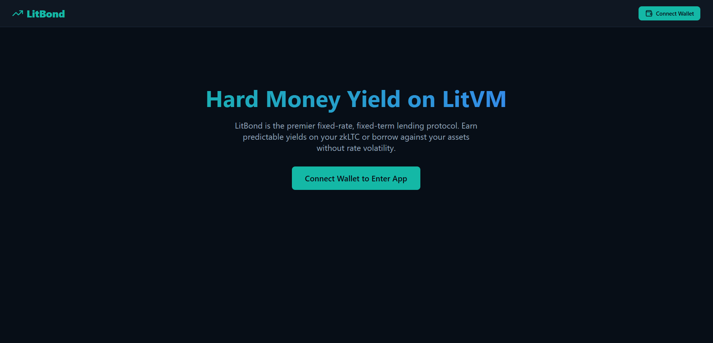

# LitBond: Fixed-Rate Lending on LitVM

LitBond is a decentralized, fixed-rate, fixed-term lending protocol native to the LitVM rollup (secured by Litecoin). 
It allows lenders to lock `zkLTC` and earn a predictable, fixed APY, while borrowers can lock collateral to receive fixed-rate loans without fear of variable rate fluctuations.

## Features
- **Fixed-Rate Term Pools**: Lenders deposit liquidity into fixed duration pools (e.g., 7-day or 30-day) and mint tradeable Receipt Tokens (e.g., `LB7D`).
- **Fixed-Rate Borrowing**: Borrowers lock collateral (e.g., `mWBTC`) and borrow `zkLTC` at a locked-in rate. Interest is calculated upfront.
- **Auto-Maturity & Repayment**: Borrowers must repay the principal + fixed interest by the maturity date to unlock collateral.
- **Liquidation Engine**: If collateral ratio falls below 110% or the loan expires, liquidators can pay off the loan to claim the collateral.
- **Institutional Aesthetic**: Designed for the "Hard Money Web3" narrative of LitVM.

## Architecture
- `LitBond.sol`: Core protocol handling pools, deposits, borrowing, and liquidation.
- `ReceiptToken.sol`: ERC-20 token minted to lenders.
- `MockCollateral.sol`: Dummy ERC-20 for testing the borrow flow.
- React Frontend (Vite + ethers.js) integrated seamlessly with the LitVM testnet.

## How to Run Locally
1. Navigate to the project directory: `cd litbond`
2. Install dependencies: `npm install`
3. Run the dev server: `npm run dev`
4. Connect your Web3 wallet to the **LitVM LiteForge** testnet (Chain ID: 4441).

*Built for the LitVM Ecosystem.*
